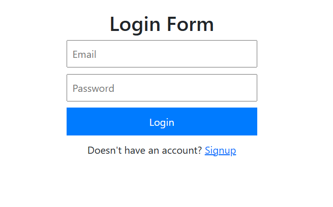
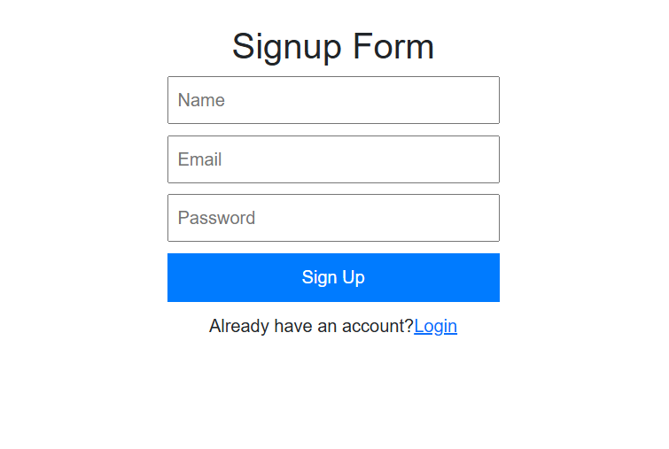
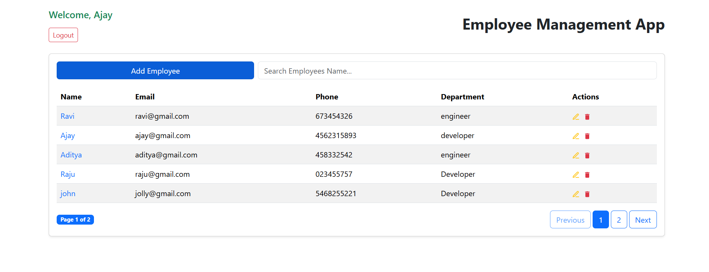
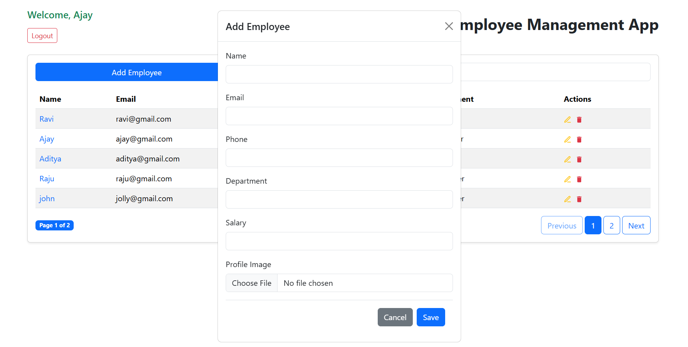
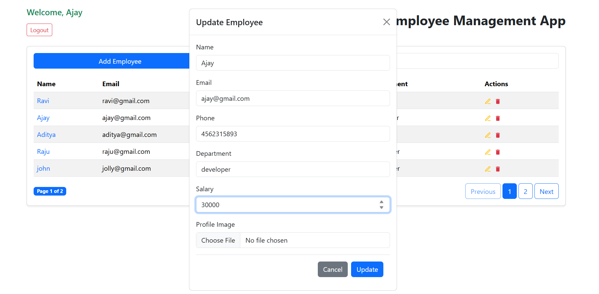

# 🧑‍💼 Employee Management System (MERN Stack)

A full-stack **Employee Management System** built using the **MERN Stack** that allows organizations to manage employees efficiently with role-based access control.

---

## 🛠 Tech Stack

### Frontend
- React.js (Vite)
- Bootstrap
- Axios
- React Router DOM
- Context API

### Backend
- Node.js
- Express.js
- MongoDB (Mongoose)
- JWT Authentication
- bcryptjs

### Deployment
- Render (Frontend & Backend)
- MongoDB Atlas

---

## ✨ Features

### 👤 Authentication & Authorization
- User Signup & Login
- JWT-based authentication
- Role-based access (Admin / Employee)
- Secure protected routes

### 🧑‍💼 Employee Management (Admin)
- Add new employees
- View all employees
- Update employee details
- Delete employees

### 🔍 Employee Access
- Employees can view their own profile
- Role-based dashboard access

### 🛡 Security
- Password hashing using bcrypt
- JWT token validation
- Protected APIs

---

## 📂 Project Structure

```
employee-management/
├── backend/
│   ├── controllers/
│   ├── routes/
│   ├── models/
│   ├── middlewares/
│   ├── config/
│   ├── server.js
│   └── .env
│
├── frontend/
│   ├── src/
│   ├── components/
│   ├── pages/
│   ├── context/
│   ├── utils/
│   └── main.jsx
```

---

## 🔐 Environment Variables

### Backend `.env`

```
PORT=5000
MONGO_URI=your_mongodb_connection
JWT_SECRET=your_jwt_secret
```

---

## ⚙️ Setup

### 2️⃣ Backend Setup
```
cd backend
npm install
npm run dev
```

### 3️⃣ Frontend Setup
```
cd frontend
npm install
npm run dev
```
📸 Screenshots ---

## 🔑 Authentication (Login & Signup)
<p align="center">
  
  
</p>

## 📊 Dashboards (Admin & User)
<p align="center">
  
  
</p>

## 📝 Employee Management (Add & Update)
<p align="center">
  
  
</p>

---

## ⭐ Show Your Support

If you like this project, please ⭐ the repository!

---

## 🔥 Final Note

This project is built to demonstrate **real-world MERN stack skills**, **clean architecture**, and **production-ready practices**.
